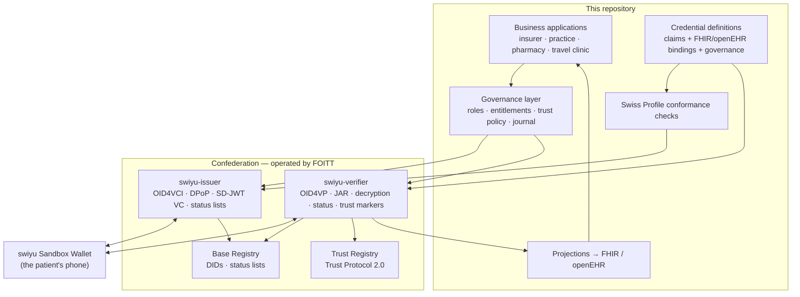
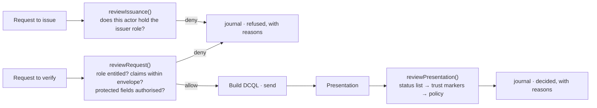

# Architecture

## The one-sentence version

Health records live in the patient's wallet as SD-JWT VCs; the clinical
information models of openEHR and HL7 FHIR are reused to describe them; the
swiyu generic components carry the protocol; and a governance layer decides who
may issue what and who may ask for which claims.

## Components

**What we do not implement, on purpose.** DPoP, key attestation, application-layer
encryption, signed issuer metadata, SD-JWT assembly and disclosure handling, JAR
signing, response decryption, key binding verification, DID resolution, status
list signing and publication, trust marker evaluation. All of it belongs to the
generic components, all of it is where conformance is won or lost, and none of it
belongs in a practice management system. The business applications create offers,
state what they want to verify, and read outcomes.

## The four layers

### 1 · Credential definitions — one source of truth

A credential type in this ecosystem needs four artefacts that must agree: the
OID4VCI `credential_configurations_supported` entry, the SD-JWT VC Type
Metadata, a JSON Schema, and an OCA bundle for the wallet's rendering.
Hand-maintaining four documents per type is how they drift apart.

Here one `CredentialDefinition` generates all four
(`scripts/generate-config.ts`), computes the CESR self-addressing digests OCA
requires and the SRI hashes that bind the documents together, and refuses to
emit anything the profile would reject. The definition also carries the two
things that are usually kept elsewhere: the **semantic bindings** onto FHIR and
openEHR, and the **governance rules** — who may issue, who may ask, for what,
with what retention.

### 2 · Governance — decisions, not documentation

Three properties are worth stating:

- **Minimisation is enforced where the query is built.** After the wallet has
  answered, the data is out; a check at the verifier is a promise, not a control.
- **MUST and SHOULD are kept apart.** A governed use case without authorization
  is refused under every policy. The profile's SHOULDs are waived under the
  Sandbox policy — and *recorded as waived*, because a demo that silently drops
  rules teaches that the rules are optional.
- **The journal holds claim names, never values.** It proves an interaction was
  within the rules without becoming a second copy of the patient's data. A test
  asserts it.

### 3 · Protocol — the generic components

Each actor runs its own instances with its own DID. The management APIs are the
only surface the business applications touch
(`IssuerManagementClient`, `VerifierManagementClient`).

`SWIYU_MODE` switches between the bundled mock and real deployments. The mock
reproduces the management contract exactly — same paths, same shapes — so
switching is a URL change. It reproduces **nothing** of the cryptography, and
says so on the page and in its own source.

### 4 · Projection — models without a repository

At presentation time, a verifier rebuilds a FHIR resource or an openEHR flat
composition from the disclosed claims, locally. Derived, never authoritative;
legitimately partial. See [F-07](../flows/F-07-model-projection.md).

Claim bindings name the FHIR element path, the openEHR archetype and the node
name as published in the Clinical Knowledge Manager. The flat path alone would
not be enough: it is specific to an operational template this project does not
publish, so it cannot be checked, and six of them were in fact wrong until they
were checked against CKM ([source verification](source-verification.md)).

Declining the repository is the project's central bet, and it has a strong
argument against it — that a vaccination record has to stay clinically usable
for a lifetime, which a point-in-time document is not. That argument, the
openEHR clinical data repository showcase it comes from, and the two directions
in which the two designs compose rather than compete, are in
[positioning](positioning.md).

## Why four separate actors

Collapsing them into one service would be simpler and would destroy the point.
Four actors means four DIDs, four trust statements, four entitlements, and
presentations that cross organisational boundaries — which is the only
configuration in which "verifiable" means anything. The check-in flow combines
credentials from the Confederation and from an insurer; the redemption flow
requires the pharmacy to ask the practice to revoke, because only the issuer can.

## Trade-offs taken

| Decision | Why | What it costs |
| --- | --- | --- |
| `vct` as a URN, not a URL | Issued credentials and DCQL queries keep their meaning when a deployment moves host | An extra indirection through `vct_metadata_uri` |
| External URL baked into generated config | The issuer metadata hashes the exact bytes of the Type Metadata; a templated URL would hash a document never served | Config must be regenerated per environment |
| One credential per vaccination dose | Authorship stays with whoever administered; each issuer revokes only their own assertion | "Is the series complete?" spans several credentials |
| Prescription revoked on dispensing | Single use without a central register of who was prescribed what | A window between presentation and revocation (F-05) |
| Mock is not cryptographic | An honest mock beats a convincing one | The mock proves nothing about conformance |
| In-memory demo state | The demo is a demo | Restarting loses encounters; credentials survive, in the wallet |
