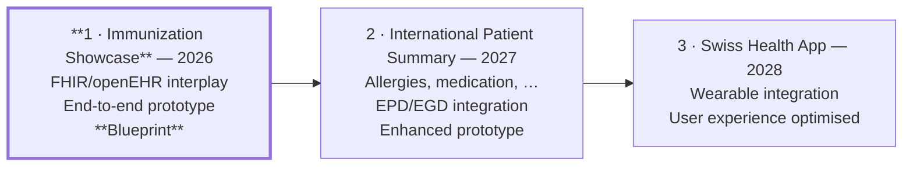

# Roadmap

The mid-term ambition has three steps. This repository is step 1, delivered in
full, with steps 2 and 3 specified and not yet started.

## Step 1 — Immunization Showcase (2026) · **this repository**

| Deliverable | Status | Where |
| --- | --- | --- |
| End-to-end prototype | done | `apps/demo`, runnable offline |
| Immunization credential, issuance and verification | done | F-02, F-03 |
| FHIR/openEHR interplay | done | F-07, `packages/swiyu/src/projections.ts` |
| Blueprint | done | [`flows/`](../flows/README.md) — eleven flows with governance and standardisation constraints |
| Governance model | done | roles, entitlements, protected fields, trust policies, journal |
| Supporting consultation flows | done | F-04, F-05 |
| Lifecycle and correction | partial | F-06: holder notification and supersession missing |
| Actor onboarding | partial | F-01: no health-domain governance body exists to grant roles |

**The blocking gap.** Nothing here can be deployed until some body can issue the
trust statement that says "this DID is a practice authorised to vaccinate". That
is a governance question rather than a technical one, and it is the principal
finding of step 1: the technology is ready some distance ahead of the
institutional arrangements. See F-01, open question 1.

## Step 2 — International Patient Summary (2027)

Specified in [F-08](../flows/F-08-patient-summary.md) and
[F-09](../flows/F-09-secondary-use.md).

What has to be built:

1. **Three further credential types** — allergies and intolerances, active
   problems, medication statements as distinct from prescriptions. Each needs
   the F-02 treatment: a model, an issuer role, an entitlement, an OCA bundle.

   Allergies are a gap here, and the other two are extensions: the 2024
   project this repository continues carried allergies in the wallet and
   requested them at check-in, and this repository does not. See
   [positioning](positioning.md).

   The IPS sections, with the LOINC codes the DIDAS lineage's own IPS wallet
   uses, are the natural unit of work: Allergies `48765-2`, Medications
   `10160-0`, Problems `11450-4`, Procedures `47519-4`, Immunizations `11369-6`,
   Results `30954-2`, Devices `46264-8`. Step 1 covers Immunizations, and
   partially Medications and Results.
2. **Multi-credential presentation at scale.** An IPS spans many credentials,
   and the profile allows one credential per DCQL query with no `multiple`.
3. **Absence semantics.** "No known allergies" must be distinguishable from "no
   allergy credential present". The IPS has codes for this; using them correctly
   is a clinical-safety requirement.
4. **Immunization series reconciliation** (F-02 open question 1), which blocks a
   trustworthy immunization section.
5. **EPD/DEP integration.** The Swiss electronic patient record is the
   incumbent. The coherent position for a decentralised design is that it
   becomes one issuer among others. That position has to be argued for.
6. **The national coverage survey** ([F-11](../flows/F-11-coverage-survey.md)).
   EBPI's Swiss National Vaccination Coverage Survey already reads the record
   the family holds, by asking for a photocopy. Replacing that photocopy with a
   presentation discloses less, arrives structured and signed, and needs no
   identifying claim, because the sampling frame already carries the age and the
   canton. It is the least costly pilot in this list, because the procedure it
   would replace is a photocopy sent by post.
7. **Composition with the openEHR/HL7 blueprint.** The joint working group of
   openEHR Switzerland and HL7 Switzerland is turning the other 2026 showcase —
   FHIR intake into an openEHR clinical data repository — into a reusable
   blueprint. Both directions of composition are already specified here (a
   repository issuing credentials from its own records; a presented credential
   projecting into the ingestion path that blueprint defines), and neither has
   been built. This is the main item on this list, because it is what makes a
   wallet credential useful to a longitudinal record instead of an alternative
   to one. See [positioning](positioning.md).
8. **Emergency access.** The hardest question in the architecture: a patient who
   is unconscious cannot consent, and any break-glass mechanism reintroduces a
   party that can read the record without them.

Prerequisite from step 1: F-06 supersession, so that a corrected result can
reference what it replaces.

## Step 3 — Swiss Health App (2028)

Specified in [F-10](../flows/F-10-continuous-data.md).

Continuous data breaks the assumption every step-1 flow rests on: that health
data comes in discrete, low-frequency, *authored* events. A vaccination has an
author who can be held responsible. A heart-rate reading does not. Before
wearables fit this architecture, four things need to exist: a summary-credential
pattern with an accountable computation step, a measurement-provenance model
that distinguishes "this device produced this" from "this describes this
person", standing-consent semantics the holder can inspect and revoke, and
clinical models for summary types that neither FHIR nor openEHR handles as
comfortably as events.

The failure mode to avoid is making an unsolved safety question look solved.

## What this repository deliberately does not do

- **Operate anything.** No registry, no CDR, no FHIR server, no patient index.
- **Replace billing.** The practice bills through existing channels.
- **Model identity proofing.** How a person obtains an e-ID is upstream.
- **Claim protocol conformance from the mock.** The mock exercises the business
  flow and the governance rules. Conformance is the generic components' job, and
  the conformance checks in `packages/swiyu/src/conformance.ts` guard the
  requests we hand them.
