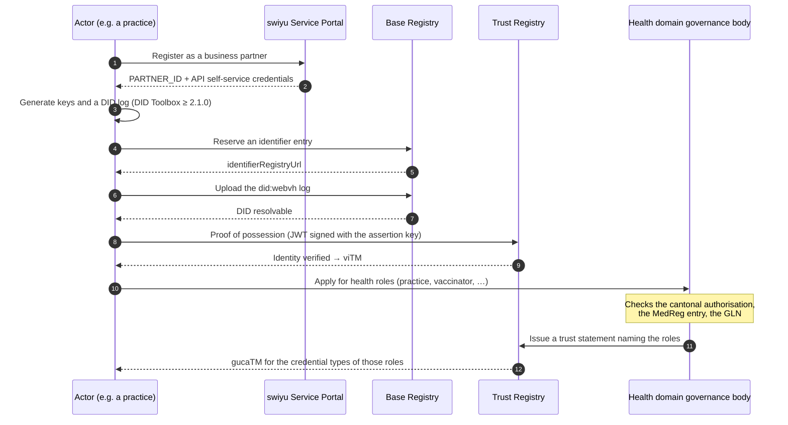

# F-01 · Becoming an actor in the health trust domain

Everything else in this blueprint assumes the answer to one question: *why
should anyone believe that the entity behind this DID is a medical practice?*
This flow is that answer. It is listed first because it is the flow most often
skipped in prototypes, and the one whose absence makes every later flow
decorative.

## Sequence

## Governance constraints

- **A role is granted by someone, not claimed.** The health domain needs a
  governance body that decides which organisations hold which roles and issues
  the corresponding trust statement. This project models the roles
  (`ROLE` in `@didas/swiyu`) and the entitlements attached to them, and assumes
  such a body exists. **It does not exist yet.** That is the single largest gap
  between this blueprint and a deployable system, and no amount of code closes
  it.
- **Role grants must be checkable against existing registers**, not invented for
  this ecosystem: the cantonal authorisation to practise, the MedReg entry, the
  GLN in the Refdata index, the BAG number for insurers. A trust statement that
  is not traceable to one of these is a new register in disguise.
- **The right to issue and the right to verify are separate grants.** A pharmacy
  that may verify a prescription does not thereby gain the right to issue one.
  The entitlement model keeps these apart (`issuerRole` versus `verifierRoles`).
- **Protected fields need their own grant.** Under `swiss-profile-trust:1.0`,
  `personal_administrative_number` — the AHV number — requires an explicit
  authorization marker regardless of which credential carries it. A practice
  needs it to bill; a pharmacy does not; both are health actors. The grant is
  per claim, not per sector.
- **Revocation of a role must propagate.** When an authorisation to practise is
  withdrawn, the trust statement has to be withdrawn too, or credentials issued
  afterwards will still verify. Nothing in the technical stack notices this on
  its own.

## Standardisation constraints

- **`did:webvh` only.** Change dossier CD-001 requires new DIDs to use
  `did:webvh`; the earlier `did:tdw` spelling is the same method renamed, and
  DIDs created under the old tooling had to be re-onboarded. Use DID Toolbox
  ≥ 2.1.0 and DID Resolver ≥ 2.8.0.
- **The Base Registry constrains the DID document.** `service`, `alsoKnownAs`,
  `keyAgreement`, `capabilityInvocation` and `capabilityDelegation` are not
  supported; `publicKeyJwk` is required and `publicKeyMultibase` must not be
  used; `portable` must be `false`, `witness` `{}` and `watchers` `[]`. A DID
  document that is valid per the W3C spec can still be rejected here.
- **One signature algorithm.** ES256, everywhere, in all four profiles.
- **Environment separation is enforced.** CD-001 separates the Sandbox from
  production: the swiyu Wallet talks only to production, the swiyu Sandbox
  Wallet only to the Sandbox, and a Sandbox DID may no longer be hosted on a
  private registry. An actor needs a distinct onboarding per environment.

## Open questions

1. **Who governs the health domain?** A cantonal health authority, the FOPH, a
   sector association, or a body constituted for the purpose. Until this is
   answered, `gucaTM` cannot be issued for health credential types and every
   deployment falls back to explicitly listed issuer DIDs, which does not scale
   past a pilot.
2. **How are roles expressed in a trust statement?** This project uses reverse
   DNS strings (`ch.didas.health.role.practice`). Whether the ecosystem adopts
   a shared vocabulary or each domain invents its own determines whether a
   verifier from another sector can interpret a health role at all.
3. **What is the appeal path** when a role is refused or withdrawn? A trust
   registry entry has real economic consequences for a practice.

## Implementation status

`partial`. The role model, the entitlements and the trust-marker evaluation are
implemented and tested. The onboarding itself is manual and documented in
`docs/onboarding-sandbox.md`; in the bundled mock, trust statements are seeded
directly, with the insurer deliberately lacking `caTM` so that the strict policy
visibly refuses it.
