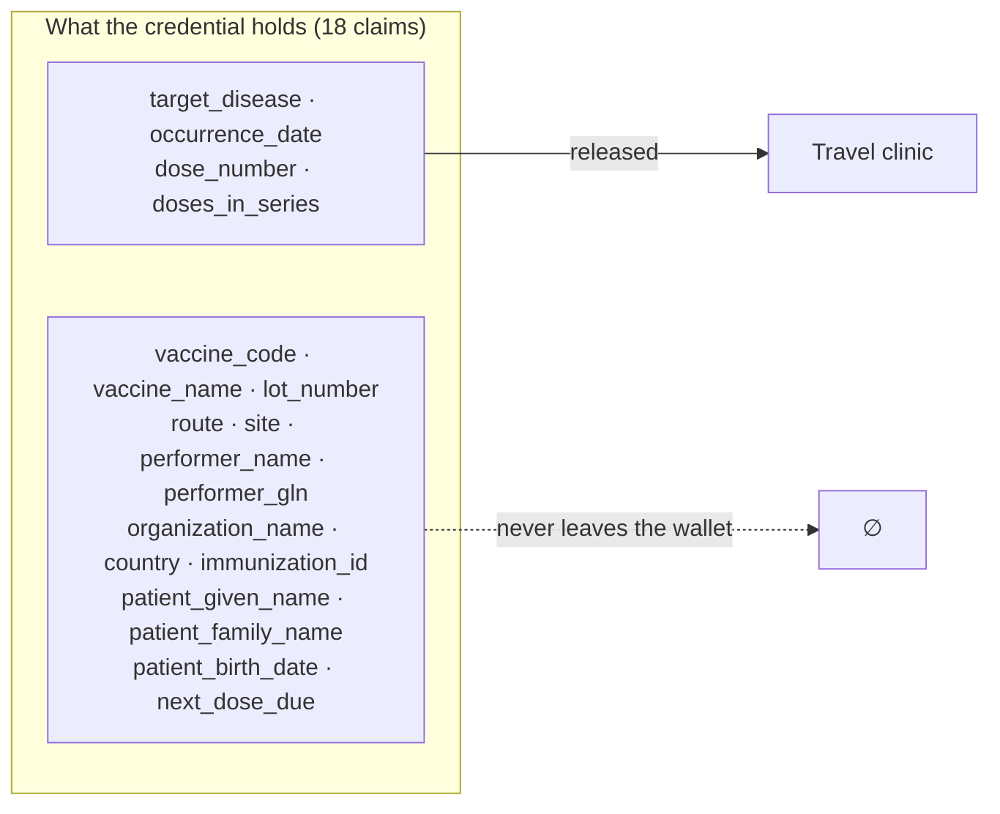

# F-03 · Proving protection, and nothing else

The flow that justifies the architecture. A travel clinic needs to know whether
the person in front of them is protected against a disease. It does not need to
know the vaccine brand, the batch number, the vaccinating physician, the clinic,
or — arguably — the patient's name, which it already has from the appointment.

This is the `verification` view of the reference model with a different claim
name: the reference flow's "is this person over 18?" and this flow's "is this
person protected against diphtheria?" are the same exchange. The mechanics are
therefore left to the [reference
diagram](https://didas-swiss.github.io/Trust-Flow-Diagram-Repository/basic-flow/)
and what follows is about what a travel clinic may ask for. One step here has no
counterpart there — the holder declining
([#5](https://github.com/DIDAS-swiss/Trust-Flow-Diagram-Repository/issues/5)).

## What is actually different here

A paper vaccination booklet handed across a counter discloses everything on the
page. A PDF exported from a portal discloses everything in the file. A registry
lookup discloses everything the registry holds, plus the fact that the lookup
happened. Selective disclosure is the first mechanism in routine use where the
holder can answer a narrow question narrowly.

The credential carries eighteen claims. The travel clinic's entitlement permits
four. The remaining fourteen are not redacted after the fact and not filtered by
the verifier's good behaviour — they are never disclosed, because the wallet
only reveals the claim paths the DCQL query names, and the query is constructed
from the entitlement.



## Sequence

```mermaid
sequenceDiagram
    autonumber
    participant T as Travel clinic (business app)
    participant GV as swiyu-verifier
    participant W as Patient wallet
    participant BR as Base Registry (status)
    participant TR as Trust Registry

    Note over T: reviewRequest(): is this role entitled<br/>to these four claims?
    T->>GV: POST /management/api/verifications<br/>(DCQL, purpose, accepted_issuer_dids)
    GV-->>T: verification_id + deeplink (PENDING)
    T-->>W: QR code (swiyu-verify://?client_id=…&request_uri=…)
    W->>GV: GET the request object
    GV-->>W: Signed JAR (oauth-authz-req+jwt, ES256)
    W->>W: Resolve client_id → verifier DID; check the trust statement
    W->>W: Show the purpose and the four claims to the holder
    W-->>W: Holder consents — or declines, which is a valid outcome
    W->>GV: POST the encrypted response (direct_post.jwt, vp_token + KB-JWT)
    GV->>BR: Resolve the status list; is the credential still valid?
    GV->>TR: Evaluate the issuer's trust markers
    GV-->>T: SUCCESS + disclosed claims + credential_evaluation
    Note over T: reviewPresentation(): status first,<br/>then trust markers, then act
```

## Governance constraints

- **The entitlement is the ceiling, and it is enforced before the request is
  built.** `reviewRequest()` refuses a query for claims outside the role's
  entitlement, so an over-broad request never reaches the patient. Enforcing
  minimisation at the wallet or at the verifier's conscience is too late: once
  the holder has answered, the data is out.
- **The purpose is registered.** `verification_purpose` carries a
  stable scope plus localised name and description, shown to the holder before
  they consent and registered at the transparency service. A verifier that wants
  to ask a different question has to say so under a different scope.
- **Declining is a first-class outcome.** `client_rejected` is a normal answer,
  not an error, and the flow must work when the patient says no — which for a
  travel clinic means falling back to the paper booklet, and care continues.
- **The verifier keeps the conclusion.** The retention rule
  on this credential type is explicit: a travel clinic needs to record that the
  series was confirmed. The governance journal
  records claim *names*, never values.
- **Trust runs both ways.** The holder's wallet checks the verifier's trust
  statement before showing the consent screen. A verifier without `viTM` asking
  for health data is exactly the case the Trust Protocol exists for, and the
  wallet is where that check has to happen.

## Standardisation constraints

- **`response_mode` must be `direct_post.jwt`.** The presentation response is
  always encrypted; cleartext `direct_post` is not an option under the profile.
- **The authorization request must be a signed JAR.** `client_id` is the
  verifier's DID, optionally prefixed `decentralized_identifier:`, and must match
  the `kid` of the signature without its fragment.
- **One credential per verification.** DCQL `multiple` is not supported, so a
  question spanning several credentials needs several queries in one request —
  or, for the immunization series, F-08.
- **Trusted authorities are DID-based.** The DCQL trusted-authority types in the
  base OID4VP specification do not apply; the Swiss Profile defines a `did` type
  carrying a list of accepted issuer DIDs.
- **The Key Binding JWT's `aud` must be the verifier's `client_id`**, and the
  wallet must first satisfy itself that the `client_id` belongs to the entity
  that signed the JAR. This is the anti-impersonation check; skipping it makes
  every other control decorative.
- **Status is checked at the Base Registry.** The profile
  forces the status provider to be the registry precisely so that presenting a
  credential does not tell its issuer where it was used.

## Open questions

1. **"Protected against X" is an inference.** The credential says
   which diseases a dose targets and when it was given. Whether that amounts to
   protection depends on the schedule, the number of doses and elapsed time. Who
   is accountable for that inference — the verifier's software, a published rule
   set, or the clinician — is unresolved, and it is a clinical-safety question
   for the sector to settle.
2. **Unlinkability across presentations.** A credential presented twice is the
   same credential; batch issuance mitigates this but is not used here, because
   with a series of dose credentials the claim values themselves are close to
   identifying. This flow is linkable, and stating so is part of the record.
3. **Herd-level reporting.** Public health needs coverage statistics that a
   fully decentralised record does not produce as a side effect. F-09 sketches
   consent-based secondary use; it is not a substitute for surveillance, and
   pretending otherwise would be the weakest claim in this blueprint.

## Implementation status

`implemented`. `TravelClinicService` in `apps/demo`; the four-of-eighteen
disclosure is asserted in `apps/demo/test/journey.test.ts`, including that the
withheld claims are absent from the response.
