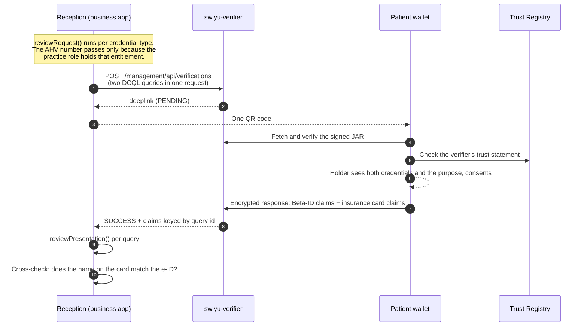

# F-04 · Check-in at the practice

Reception, in one QR code: who are you, and who is paying.

## What is different from a card reader

Two credentials from two unrelated issuers arrive in a single presentation, each
cryptographically bound to the same wallet key. The practice learns the patient's
identity from the Confederation's credential and their cover from the insurer's,
and can notice when the two disagree — a check a card reader cannot perform,
because the card asserts both and nothing corroborates it.

The claim list is where the data-minimisation argument becomes concrete. The
practice asks for ten claims about cover and three about identity, and for
nothing at all about health. The AHV number is among them because a Swiss
practice bills with it, which is why it is a protected field and why
the entitlement for it is written down and reviewable.

## Sequence

## Governance constraints

- **Protected field, explicit entitlement.** `personal_administrative_number`
  requires a Governed Use Case Authorization Trust Marker. The practice holds it;
  the pharmacy does not, and `reviewRequest()` refuses a pharmacy that asks —
  tested: a test presents a query built for the pharmacy role and asserts that
  the AHV number is refused.
- **No health data at check-in.** The purpose scope `ch.didas.health.checkin`
  covers identity and cover. A practice that wants the patient's medication list
  is asking a different question and must register a different purpose.
- **A name mismatch is flagged to a human.** The two
  issuers disagreeing is the interesting case — a married name, a data entry
  error, or something worse — and reception is better placed than software to
  decide which.
- **Retention follows the billing record**: ten years under
  OR Art. 958f for what the practice legitimately keeps. The credential itself is
  not stored.

## Standardisation constraints

- Two DCQL credential queries in one authorization request; `multiple` remains
  unsupported, so this is two *queries* inside one presentation request, each
  naming its own credential type and claim paths.
- `accepted_issuer_dids` is set per query, so the Beta-ID must come from the
  Beta Credential Service and the card from the patient's insurer. Without it the
  verifier would accept any issuer, which `checkVerificationRequest()` refuses.
- Beta-ID carries the Art. 15 BGEID attribute set. The e-ID replaces it at
  go-live with the same attributes, so this flow does not change in 2026 — only
  the issuer DID and the `vct` do.
- The insurance card models FHIR `Coverage`; there is no openEHR archetype for
  an insurance relationship, and inventing one would be worse than pointing at
  the standard that already covers it.

## Open questions

1. **Patients without a wallet.** Check-in must degrade to the plastic card
   without making those patients second-class. This is a service-design question
   the demo does not answer.
2. **Delegation.** A parent checking in a child, or a carer acting for someone
   else, has no representation model in the trust infrastructure today.
3. **Whether the practice should receive a name at all** when the appointment
   already establishes it. Asking for less than the entitlement permits is always
   allowed, and arguably should be the default.

## Implementation status

`implemented`. `PraxisService.startCheckIn` / `completeCheckIn`; covered by
`apps/demo/test/journey.test.ts`, including the declined-consent and
missing-credential paths.
