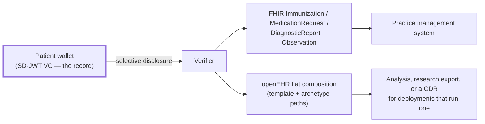

# F-07 · Projecting a presented credential into FHIR and openEHR

This flow is the answer to the obvious objection: *the health sector already has
information models and systems that speak them — why would it adopt a credential
format?*

It does not have to. The credential carries the model with it.

## The architectural position

openEHR and HL7 FHIR give the sector two things that are usually delivered
together but are separable:

1. **Shared information models** — archetypes, templates, resource profiles,
   terminology bindings. Decades of clinical modelling work, and the reason a lab
   result means the same thing in two systems.
2. **A shared repository** — a clinical data repository or a FHIR server that
   someone operates, that someone governs, and that the patient does not control.

This project reuses the first and declines the second. Every claim in every
credential type carries the FHIR element path and, where one exists, the openEHR
archetype path it corresponds to. At the moment of presentation, the receiving
system rebuilds the representation it already understands — locally, from what
the holder released, with no repository involved on either side.

## Two properties to preserve

- **A projection is derived, never authoritative.** The signed SD-JWT VC is the
  evidence. The FHIR resource built from it carries no signature and proves
  nothing on its own. A system that needs provenance must retain the
  presentation. Most systems will retain the projection, and that risk is worth
  stating plainly.
- **A projection is legitimately partial.** After selective disclosure, a
  `DiagnosticReport` may have findings and no patient name. Receiving systems
  must tolerate that instead of treating a missing element as an error. This is
  the main integration cost of the whole approach, and it is real.

## Governance constraints

- **Projection does not launder entitlement.** Claims the verifier was not
  entitled to are absent from the projection because they were never disclosed.
  Nothing downstream can reconstruct them.
- **Retention attaches to the projection too.** Building a FHIR resource is how a
  verifier retains data; the retention rule on the credential type governs it.
- **Unmapped claims are reported.** Both projections return the list
  of disclosed claims that had no binding, so a modelling gap surfaces instead of
  silently losing data.

## Standardisation constraints

- Immunization → `Immunization` (CH VACD; `Immunization-uv-ips` from step 2) and
  `openEHR-EHR-ACTION.medication.v1`.
- Prescription → `MedicationRequest` (CH EMED) and
  `openEHR-EHR-INSTRUCTION.medication_order.v3`.
- Laboratory report → `DiagnosticReport` + one `Observation` per finding, and
  `openEHR-EHR-OBSERVATION.laboratory_test_result.v1`.
- Insurance card → `Coverage` (CH Core). No openEHR model: openEHR describes the
  clinical record.
- Terminology: SNOMED CT for vaccines and diseases, LOINC for analytes, UCUM for
  units, GTIN for medication packs, GLN for professionals, AHVN13 for the
  protected administrative number.
- openEHR output is flat format — template path to value, with `:n` indices on
  repeating nodes — which is what a CDR's flat endpoint accepts for deployments
  that have one.

## Open questions

1. **Round-tripping.** Projection is one-way. Whether a FHIR resource should be
   convertible back into a credential — and who would sign it — is a step-2
   question raised by the openEHR/HL7 joint working group's ambitions.
2. **Profile conformance is claimed and never validated.** The resources assert
   `meta.profile` but are not run through a FHIR validator in CI. That is a
   gap, and a cheap one to close.
3. **openEHR templates are sketched and unpublished.** `DIDAS.immunisation.v0`
   and its siblings are named here; real operational templates would have to be
   modelled and published for the paths to be more than plausible.

## Implementation status

`implemented`. `packages/swiyu/src/projections.ts`, covered by
`packages/swiyu/test/projections.test.ts`, and visible in the demo UI next to
the credential it was built from.
