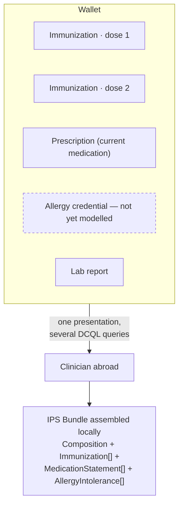

# F-08 · Assembling an International Patient Summary (roadmap, 2027)

Roadmap step 2. Specified here, deliberately not built.

The International Patient Summary is the standardised minimum dataset for
unplanned care: allergies, current medication, problems, and — the reason it
belongs in this blueprint — immunizations. It is designed for the case where a
clinician who has never seen you needs to know the few things that could kill
you, possibly in another country.

The interesting question is **where the summary is assembled**. The usual answer
is a national infrastructure that holds the data and renders a summary on
request. The proposal here is that the wallet assembles it: an IPS Bundle
constructed at presentation time from the credentials the patient holds, each
contributed by whoever issued it, each independently verifiable.

## What step 2 has to solve

- **Credential types this project does not model.** Allergies and intolerances,
  active problems, and medication *statements* as distinct from prescriptions.
  These are the clinically load-bearing parts of an IPS and each needs the same
  treatment F-02 gave immunizations: a model, an issuer role, an entitlement.
- **Multi-credential presentation.** An IPS spans several credentials, but the
  Swiss Profile currently allows one credential per DCQL query and no `multiple`.
  Several queries in one request works; whether it scales to a full summary, and
  what happens when the patient holds twelve dose credentials, is untested.
- **Completeness is unknowable.** A summary assembled from held credentials can
  only report what the patient holds. A clinician reading it must be able to tell
  "no known allergies" from "no allergy credential present" — the IPS has
  `absent/unknown` codes for exactly this, and using them correctly is the
  difference between a useful summary and a dangerous one.
- **Series reconciliation** (open question 1 of F-02) has to be resolved before
  an immunization section can be trusted.
- **EPD/DEP integration.** Switzerland's electronic patient record exists and is
  the incumbent. Step 2 has to define whether the wallet reads from it, writes to
  it, or neither. The position a decentralised design has to argue is that the EPD
  becomes one issuer among others.

## Governance constraints to carry forward

- Emergency access is the hardest case in the whole architecture: the patient may
  be unconscious, and consent-at-presentation assumes they are not. Any
  break-glass mechanism reintroduces a party that can read the record without the
  holder's involvement, which is the property this design exists to avoid.
- Cross-border presentation means a verifier outside the Swiss trust registry.
  Either the trust infrastructure federates, or the flow degrades to "a
  clinician reads a rendered summary and decides how much to believe it".
- An IPS is a clinical document; who is accountable for a summary nobody
  authored is a genuine question that does not arise when a clinician compiles it.

## Why it is not built here

Step 1 is a working end-to-end case with governance. Step 2 requires modelling
three further credential types, resolving multi-credential presentation, and
answering the emergency-access question. Building a partial IPS would suggest
those are solved.
