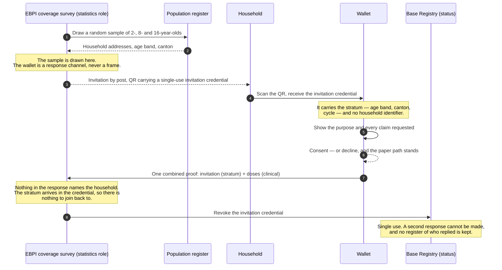

# F-11 · Answering the national coverage survey (roadmap, 2027)

Of the eleven flows in this set, this is the one where a credential presentation
discloses less than the procedure it would replace.

Switzerland measures vaccination coverage with the Swiss National Vaccination
Coverage Survey, coordinated by the **Epidemiology, Biostatistics and
Prevention Institute (EBPI)** at the University of Zurich with the Federal
Office of Public Health and all 26 cantons, and running since 1999: randomly
selected households of 2-, 8- and 16-year-olds, a three-year rolling cycle, and
a request that the family **post a copy of the child's vaccination record**.

The data source is already the record the family holds. This flow replaces the
photocopy.

## How a coverage survey differs from the clinical flows

In every other verification here, a holder discloses something to an
organisation acting in its own interest: a clinic, a pharmacy, an insurer. A
coverage survey differs in four respects, and each of them removes a difficulty
the other flows have to address.

- **Consent is already the model.** Households are invited and may refuse. The
  flow does not introduce a consent step; it replaces a postal one.
- **No identity is needed.** The survey drew the household from the population
  register, so it already knows the age band and the canton. What it cannot
  know is the clinical fact.
- **The purpose is public and stable.** "National vaccination coverage
  monitoring" is exactly what a Verification Query Public Statement is for, and
  it stays true across cycles.
- **Disclosure decreases.** A photocopied booklet shows every dose, every date,
  the vaccinating physician, and usually the child's name. The entitlement below
  releases five claims and no identifier.

## Sequence

## Unlinkability

Unlinkability means that the party receiving the data cannot connect it to the
person it came from, and cannot connect two separate submissions to each other.
For a coverage survey it is the property that matters most: a response that can
be traced back to a household turns the survey into a register of who replied
and what they replied.

An earlier draft of this flow had the survey join each response to its sampling
record by an invitation token. That token is a household identifier, and holding
it would have produced exactly that register. The design below removes the need
for it.

**The invitation credential carries the stratum.** The QR in the posted letter
offers a single-use credential issued by the survey, holding the age band, the
canton and the cycle, and no household identifier. The household's own claims
travel with it in one combined proof. The survey therefore learns *"a household
in this canton with an 8-year-old reported these doses"* and has nothing to join
back to, because there is no key to join on.

**Single use is enforced on the status list.** The invitation is revoked when
the response is accepted, so a second response cannot be made. This is the F-05
prescription mechanism applied to a survey ballot: the same two bits, the same
public list, and no register of who was invited or who replied.

**Three rules follow, and they are governance rather than cryptography:**

1. **Record nothing that could be recorded.** A verifier receives a signed
   presentation and can keep all of it. The survey must extract the analysis
   variables and discard the rest, including the presentation transcript, the
   credential, and the issuer signatures. Technically it could keep them; the
   rule is that it does not, and an auditor should be able to check that.
2. **No presentation metadata is retained.** Timing, IP, user agent, wallet
   version and response ordering are all identifying in a sample this small.
   Coverage analysis needs none of them.
3. **The decline is not recorded either.** Non-response is handled by the
   existing postal follow-up, which knows who was invited. Nothing needs a
   record that a particular household opened a request and refused.

**What remains technically linkable.** The survey both issues the invitation and
revokes it. If it retains the mapping from invitation index to posted address,
revoking index *n* after a response tells it which household replied, and the
analysis row arriving at the same moment can be correlated to it by timing.
Governance can forbid retaining that mapping; nothing in the protocol prevents
it.

Closing that properly needs one of two things, and both are open:

- **Batch issuance**, so the invitation presented is not the invitation issued
  to a known index — the profile supports batches of at least ten, and this
  project does not use them.
- **A zero-knowledge presentation**, so the proof reveals eligibility and
  stratum without revealing which invitation it came from.
  [Longfellow ZK](https://github.com/DIDAS-swiss/digital-health_swiyu/issues/10)
  is the candidate, because it proves statements about ES256 signatures without
  changing the credential.

Until one of them is in place, the unlinkability of this flow rests on the survey
following its own rules. That is a weaker guarantee than one enforced by the
protocol, and this document states it as such rather than describing the flow as
unlinkable without qualification.

## What is disclosed

The `ch.didas.health.role.statistics` entitlement on the immunization
credential:

| Claim | Why the survey needs it |
| --- | --- |
| `target_disease` | The unit of analysis: coverage is per disease |
| `occurrence_date` | Timeliness, and whether a dose fell in the recommended window |
| `dose_number` | Position in the series |
| `doses_in_series` | What the series was expected to be |
| `vaccine_code` | Product-level analysis, and combination vaccines |

From the invitation credential, issued by the survey itself:

| Claim | Why the survey needs it |
| --- | --- |
| `stratum_age` | The 2 / 8 / 16 cohort the sample was drawn for |
| `stratum_canton` | Cantonal stratification, which is how the survey reports |
| `survey_cycle` | Which three-year cycle this response belongs to |

No household identifier appears in either credential.

Not disclosed: `immunization_id`, `patient_given_name`, `patient_family_name`,
`patient_birth_date`, `vaccine_name`, `next_dose_due`, `lot_number`, `route`,
`site`, `performer_name`, `performer_gln`, `organization_name`, `country`.

Thirteen of eighteen claims stay in the wallet, including every one that
identifies a person or a practitioner.

## Governance constraints

- **The sampling frame stays where it is.** The wallet improves the *response*,
  never the *selection*. A survey that let people volunteer their credentials
  would be measuring the people who volunteer, and
  [the public health view](../docs/public-health.md) explains why that estimate
  cannot be corrected from inside the sample. This constraint governs the whole
  design.
- **A statistics role, distinct from research.** A coverage survey runs under a
  statistical mandate; F-09's research use runs under the Human Research Act,
  with a review board and revocable consent. Different legal basis, different
  entitlement, different retention — so a different role rather than a reuse of
  `research`.
- **Retention is the analysis dataset, and nothing beside it.** The survey keeps
  derived variables. The presentation transcript, the credentials, the issuer
  signatures and every scrap of request metadata are discarded on receipt. The
  rule is "record nothing that could be recorded", and it has to be auditable,
  because a verifier is technically free to keep all of it.
- **Single use is enforced, and participation is not.** Revoking the invitation
  on acceptance stops a second response. It must not become a record of who
  responded: the survey learns that invitation *n* was used, and must not retain
  what *n* was posted to.
- **Declining is ordinary and must stay cheap.** Non-response is a fact of
  survey work and the method already handles it with up to three contact
  attempts. A wallet refusal has to route back to the postal path rather than
  drop the household.
- **The purpose is published before it is used.** The vqPS entry is the
  mechanism by which a household can check that the request in front of them
  matches what the survey said it would ask, without taking the request's word
  for it.

## Standardisation constraints

- **`swiss-profile-verification:1.0.0`** throughout: DCQL, a signed request
  object, `direct_post.jwt`.
- **DCQL `multiple` is NOT SUPPORTED.** A child's series is several dose
  credentials, and one query returns one credential. A full history is
  therefore N queries in one request, which is the same limitation F-04 hits
  with two credentials and is worse here.
- **Predicate proofs do not exist in this profile.** SD-JWT discloses a claim
  or withholds it; it cannot prove a property of a withheld claim. There is no
  way to show "this person is 8" without disclosing the birth date. The flow
  avoids needing one only because the sampling frame already carries the age —
  a different survey design would hit this wall immediately.
- **CH VACD supplies the denominator of "complete".** The FOPH/EKIF vaccination
  plan defines the expected series, and
  `ch-vacd-ch-vaccination-plan-immunizations-vs` carries it as a value set. The
  survey should evaluate completeness against that rather than against
  `doses_in_series` as asserted by an issuer.

## Open questions

1. **Absence is ambiguous, and unresolved it invalidates the estimate.** A
   missing credential may mean no dose, or a dose given before credentials
   existed, or a dose from an issuer who never issued one. A coverage estimate
   that reads absence as "unvaccinated" is biased downwards by an unknown
   amount. The survey's paper method has the same problem and handles it by
   asking; a credential flow needs an explicit "no further doses" attestation,
   which nothing in this project issues. This is the same absence-semantics gap
   [F-08](F-08-patient-summary.md) records, and it matters more here because the
   output is a published statistic.
2. **Unlinkability is designed for and not yet enforced.** The invitation
   credential removes the household identifier and the status list makes the
   response single-use, so the survey has no key to join on. Two leaks remain,
   and both are technical rather than procedural:

   - The survey issues and revokes the invitation, so a retained mapping from
     invitation index to posted address re-links the response by timing.
   - The same dose credentials presented in two cycles three years apart are
     linkable to each other.

   Batch issuance or a zero-knowledge presentation closes both;
   [issue 10](https://github.com/DIDAS-swiss/digital-health_swiyu/issues/10)
   tracks the second. Until then this flow is unlinkable by governance and not
   by construction, which is the weaker guarantee.
3. **Who accredits a survey.** The statistics role needs the same
   authorisation layer that does not exist for any health role
   ([F-01](F-01-actor-onboarding.md)). A verifier claiming to be a national
   survey is the case where a holder most needs to be able to check the claim.
4. **Whether a partial history is usable.** If a household presents four of six
   dose credentials, the survey has to decide whether that is a coverage
   observation or a non-response. That is a methodological question for the
   survey's owners, not a technical one.

## Implementation status

`roadmap`. The entitlement is defined on the immunization credential and the
`statistics` role exists in the governance model, so a query built for this role
is already refused the identifying claims.

Nothing else is built. The invitation credential type, the combined proof, the
revoke-on-acceptance step and the survey actor are all specified here and absent
from the code. The two mechanisms that would make the unlinkability structural —
batch issuance, or a zero-knowledge presentation — are unused and unavailable
respectively.

Of the uses described in this repository, this one has the clearest
public-interest rationale and the lowest cost to pilot, because the procedure it
would replace is a photocopy sent by post.
