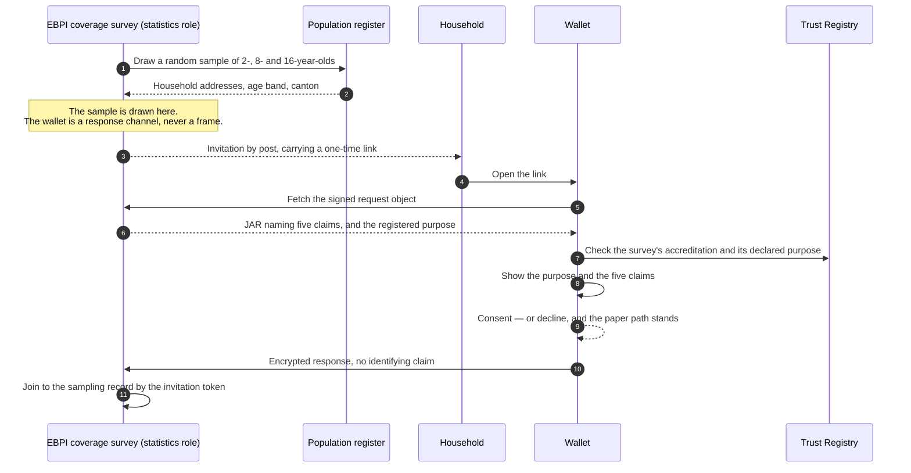

# F-11 · Answering the national coverage survey (roadmap, 2027)

The one flow in this set where selective disclosure is not a mitigation of a
privacy problem but the whole point of the exercise.

Switzerland measures vaccination coverage with the Swiss National Vaccination
Coverage Survey, coordinated by the **Epidemiology, Biostatistics and
Prevention Institute (EBPI)** at the University of Zurich with the Federal
Office of Public Health and all 26 cantons, and running since 1999: randomly
selected households of 2-, 8- and 16-year-olds, a three-year rolling cycle, and
a request that the family **post a copy of the child's vaccination record**.

The data source is already the record the family holds. This flow replaces the
photocopy.

## Why this fits better than the clinical flows

Every other verification here asks a holder to disclose something to an
organisation acting in its own interest — a clinic, a pharmacy, an insurer.
A coverage survey is different in four ways, and each of them removes a
difficulty the other flows have to argue around.

- **Consent is already the model.** Households are invited and may refuse. The
  flow does not introduce a consent step; it replaces a postal one.
- **No identity is needed.** The survey drew the household from the population
  register, so it already knows the age band and the canton. What it cannot
  know is the clinical fact.
- **The purpose is public and stable.** "National vaccination coverage
  monitoring" is exactly what a Verification Query Public Statement is for, and
  it stays true across cycles.
- **Disclosure goes down, not up.** A photocopied booklet shows every dose,
  every date, the vaccinating physician, and usually the child's name. The
  entitlement below shows five claims and no identifier.

## Sequence

## What is disclosed

The `ch.didas.health.role.statistics` entitlement on the immunization
credential:

| Claim | Why the survey needs it |
| --- | --- |
| `target_disease` | The unit of analysis: coverage is per disease |
| `occurrence_date` | Timeliness, and whether a dose fell in the recommended window |
| `dose_number` | Position in the series |
| `doses_in_series` | What the series was expected to be |
| `vaccine_code` | Product-level analysis, and combination vaccines |

Not disclosed: `immunization_id`, `patient_given_name`, `patient_family_name`,
`patient_birth_date`, `vaccine_name`, `next_dose_due`, `lot_number`, `route`,
`site`, `performer_name`, `performer_gln`, `organization_name`, `country`.

Thirteen of eighteen claims stay in the wallet, including every one that
identifies a person or a practitioner.

## Governance constraints

- **The sampling frame stays where it is.** The wallet improves the *response*,
  never the *selection*. A survey that let people volunteer their credentials
  would be measuring the people who volunteer, and
  [the public health view](../docs/public-health.md) explains why that estimate
  cannot be corrected from inside the sample. This is the constraint that makes
  or breaks the flow.
- **A statistics role, distinct from research.** A coverage survey runs under a
  statistical mandate; F-09's research use runs under the Human Research Act,
  with a review board and revocable consent. Different legal basis, different
  entitlement, different retention — so a different role rather than a reuse of
  `research`.
- **Retention is the analysis dataset.** The survey keeps derived records, not
  credentials. It has no use for a credential after the claims are extracted,
  and holding one would be holding a signed artefact it did not need.
- **Declining is ordinary and must stay cheap.** Non-response is a fact of
  survey work and the method already handles it with up to three contact
  attempts. A wallet refusal has to route back to the postal path rather than
  drop the household.
- **The purpose is published before it is used.** The vqPS entry is the
  mechanism by which a household can check that the request in front of them
  matches what the survey said it would ask, without taking the request's word
  for it.

## Standardisation constraints

- **`swiss-profile-verification:1.0.0`** throughout: DCQL, a signed request
  object, `direct_post.jwt`.
- **DCQL `multiple` is NOT SUPPORTED.** A child's series is several dose
  credentials, and one query returns one credential. A full history is
  therefore N queries in one request, which is the same limitation F-04 hits
  with two credentials and is worse here.
- **Predicate proofs do not exist in this profile.** SD-JWT discloses a claim
  or withholds it; it cannot prove a property of a withheld claim. There is no
  way to show "this person is 8" without disclosing the birth date. The flow
  avoids needing one only because the sampling frame already carries the age —
  a different survey design would hit this wall immediately.
- **CH VACD supplies the denominator of "complete".** The FOPH/EKIF vaccination
  plan defines the expected series, and
  `ch-vacd-ch-vaccination-plan-immunizations-vs` carries it as a value set. The
  survey should evaluate completeness against that rather than against
  `doses_in_series` as asserted by an issuer.

## Open questions

1. **Absence is ambiguous, and for this flow that is fatal if unsolved.** A
   missing credential may mean no dose, or a dose given before credentials
   existed, or a dose from an issuer who never issued one. A coverage estimate
   that reads absence as "unvaccinated" is wrong in a direction that matters.
   The survey's paper method has the same problem and handles it by asking; a
   credential flow needs an explicit "no further doses" attestation, which
   nothing in this project issues. This is the same absence-semantics gap
   [F-08](F-08-patient-summary.md) records, and it bites harder here.
2. **Linkability across cycles.** The same dose credentials presented in two
   survey cycles are linkable to each other. The survey has no need to follow
   individuals over time, so batch issuance or one-time credentials would suit
   it — and F-03 already records that this project does not use them.
3. **Who accredits a survey.** The statistics role needs the same
   authorisation layer that does not exist for any health role
   ([F-01](F-01-actor-onboarding.md)). A verifier claiming to be a national
   survey is exactly the verifier a holder should be able to check.
4. **Whether a partial history is usable.** If a household presents four of six
   dose credentials, the survey has to decide whether that is a coverage
   observation or a non-response. That is a methodological question for the
   survey's owners, not a technical one.

## Implementation status

`roadmap`. The entitlement is defined on the immunization credential and the
`statistics` role exists in the governance model, so a query built for this role
is already refused the identifying claims. Nothing else is built: no survey
actor, no invitation token, no flow in the demo.

It is the most concrete public-interest use of this architecture, and the
cheapest to pilot, because the counterfactual is a photocopy in an envelope.
